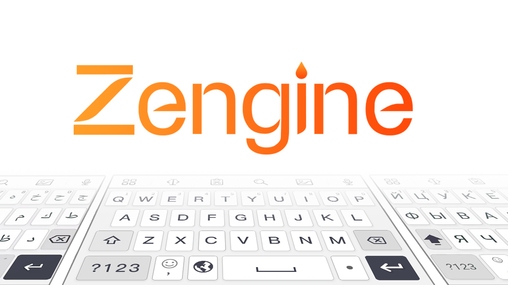
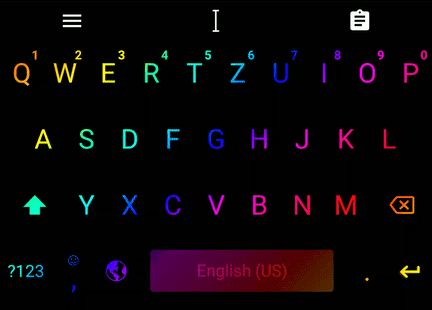
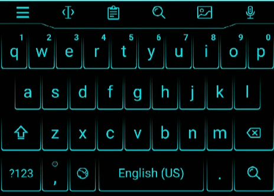

#### The most powerful Android Keyboard project is online now!

#### Build the most efficient personalized keyboard for your users in 1 day. 

## Input support

* More than 180 languages with dictionaries and AI language models ready to be downloaded
* Emoji keyboard
* Various keyboard layouts, including qwerty, qwertz, azerty layouts for Latin scripts, and dynamic Indian language script layouts and so on
* Input by keys, with auto-capitalization on first word of sentence, auto-completion, error-correction, and next-word prediction
* Input by sliding
* AI-powered next-word prediction
* AI-powered 10 Indian languages (Hindi, Bengali, Marathi, Tamil, Telugu, Kannada, Gujarati, Punjabi, Malayalam, Urdu) transliteration, using Latin script to type Indian languages words
* Vietnamese Telex input
* Chinese input
* Callbacks for various input event. For example, when the user is typing Good Morning, contents related to Good Morning can be recommended to the user through our API

## Theme support

Beautiful themes are necessary to attract users. 

With the help of the theme customization framework, it's very easy for you to make quality themes. The following Led effect theme and Neon theme are made with our theme API. 

Plenty of beautiful theme packs can be downloaded from server. 

## Functions

* Keyboard menu
* Selector control
* Clipboard
* Gif search 
* Gifs sending
* Floating keyboard

## Tutorials
1. [Building a new software keyboard](https://github.com/NlptechProduct/Android-Keyboard/blob/master/Build%20a%20New%20Virtual%20Keyboard%20Project.md)
2. [Migrating to Zengine from an AOSP-based software keyboard project](https://github.com/NlptechProduct/Android-Keyboard/blob/master/Migration%20Guide.md)
3. [Customization](https://github.com/NlptechProduct/Zengine/blob/master/Customized%20Keyboard%20Features.md)

## Other resources
1. [Language supported list](https://github.com/NlptechProduct/Android-Keyboard/blob/master/Language%20List.md)
2. [API reference](https://github.com/NlptechProduct/Zengine/blob/master/Reference.md)
3. [FAQ](https://github.com/NlptechProduct/Zengine/blob/master/FAQ.md)
4. [Privacy Policy](http://zengine.nlptech.com/privacy.txt)

## License

    Copyright 2019 NLP Tech
    
    Licensed under the Apache License, Version 2.0 (the "License");
    you may not use this file except in compliance with the License.
    You may obtain a copy of the License at

       http://www.apache.org/licenses/LICENSE-2.0

    Unless required by applicable law or agreed to in writing, software
    distributed under the License is distributed on an "AS IS" BASIS,
    WITHOUT WARRANTIES OR CONDITIONS OF ANY KIND, either express or implied.
    See the License for the specific language governing permissions and
    limitations under the License.
